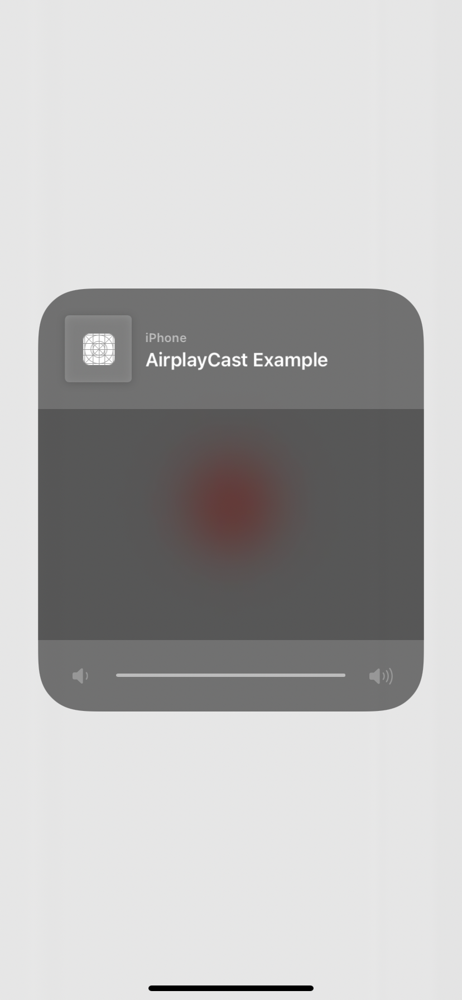

# react-native-airplay-button

Stream audio or video to AirPlay-enabled devices with a customizable AirPlay button.

 

## Installation

```sh
npm install react-native-airplay-button --save

```

**React Native 0.60 and above**

Run `npx pod-install`. Linking is not required in React Native 0.60 and above.

**React Native 0.59 and below**

Run `react-native link react-native-airplay-button` to link the react-native-airplay-button library.

## Usage

```js
import AirPlayButton from "react-native-airplay-button";

<AirPlayButton 
  activeTintColor="blue"
  tintColor="red"
  prioritizesVideoDevices={false}
  style={{ width: 30, height: 30 }}
/>
```

## Contributing

See the [contributing guide](CONTRIBUTING.md) to learn how to contribute to the repository and the development workflow.

## License

MIT
